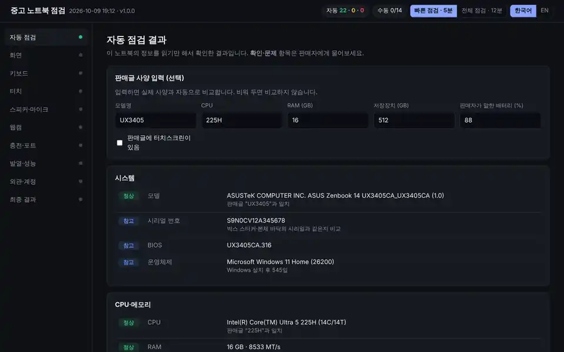
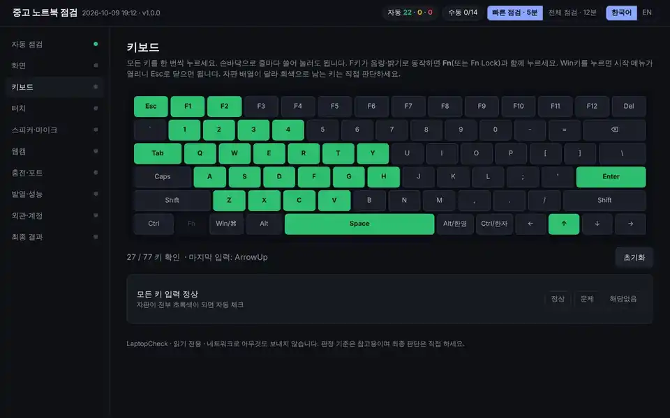
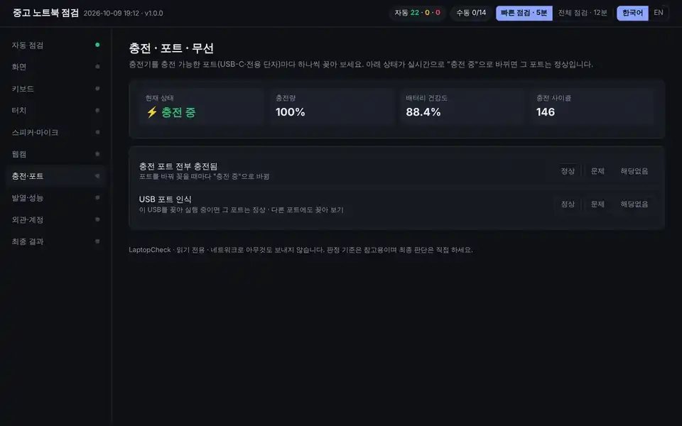
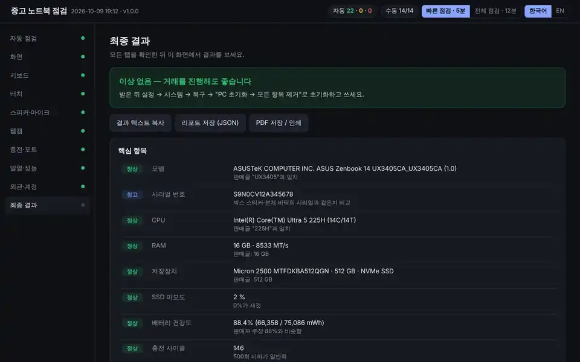

# LaptopCheck · 중고 노트북 5분 점검 키트

**[English](README.en.md)** · [판정 기준 전체 보기](docs/CHECKS.md) · [다운로드 (최신 버전)](../../releases/latest)

> 중고 노트북 직거래 현장에서 **USB를 꽂고 더블클릭 한 번**으로 배터리·SSD 수명, 숨겨진 고장 이력, 화면·키보드·스피커·포트 상태까지 5분 안에 확인하는 무료 도구입니다.
> 설치가 필요 없고, 판매자의 노트북에서 **아무것도 바꾸지 않으며**, 인터넷으로 **아무것도 보내지 않습니다.**



---

## 목차

1. [왜 만들었나요](#왜-만들었나요)
2. [이런 상황에 쓰세요](#이런-상황에-쓰세요)
3. [무엇을 확인하나요](#무엇을-확인하나요)
4. [사용 방법 — 처음부터 끝까지](#사용-방법--처음부터-끝까지)
5. [화면별 설명](#화면별-설명)
6. [결과 읽는 법과 대처 방법](#결과-읽는-법과-대처-방법)
7. [안전한가요?](#안전한가요)
8. [자주 묻는 질문 · 문제 해결](#자주-묻는-질문--문제-해결)
9. [개발자용](#개발자용)

---

## 왜 만들었나요

중고 노트북 직거래에서는 보통 전원을 켜 보고, 화면을 훑어보고, 키보드를 몇 번 두드려 보고 거래가 끝납니다.
하지만 실제로 돈이 드는 고장은 **눈으로 보이지 않는 곳**에 있습니다.

| 겉으로는 멀쩡해 보여도 | 실제로는 |
|---|---|
| "배터리 양호합니다" | 설계 용량의 65%만 남아 2시간도 못 버팀 |
| "깨끗하게 썼어요" | 최근 3개월 동안 블루스크린 12회, 전원이 갑자기 꺼진 기록 20회 |
| "RAM 16GB예요" | 실제로는 8GB |
| "화면 문제없어요" | 회색 화면에서만 보이는 작업표시줄 번인(OLED) |
| "충전 잘 돼요" | USB-C 포트 두 개 중 하나는 충전이 안 됨 |

LaptopCheck는 이런 항목을 **Windows가 이미 기록해 둔 정보**로 확인하고, 사람이 직접 봐야 하는 부분은 **순서대로 안내**합니다.
판정 기준은 모두 공개되어 있어서, 판매자에게 결과 화면을 그대로 보여 주고 이야기할 수 있습니다.

---

## 이런 상황에 쓰세요

### 🛒 살 때
- **당근마켓·번개장터·중고나라 직거래:** 판매자를 만나 5분 안에 점검합니다. 이 도구를 만든 가장 큰 이유입니다.
- **가격 협상 근거가 필요할 때:** "배터리 건강도 72%, 충전 사이클 610회"처럼 숫자로 이야기할 수 있습니다.
- **지인·가족에게 노트북을 물려받을 때:** 배터리를 갈아야 하는지, SSD가 얼마나 남았는지 미리 알 수 있습니다.
- **회사·학교 반납 노트북이나 리퍼 제품을 살 때:** 판매글 사양(CPU·RAM·용량)과 실제 사양이 같은지 대조합니다.

### 💰 팔 때
- **내 노트북 상태를 증명하고 싶을 때:** 판매글을 올리기 전에 돌려 보고, 결과(PDF·텍스트)를 판매글에 첨부하면 신뢰도가 올라갑니다.
- **적정 판매가를 정할 때:** 배터리·SSD 상태가 좋으면 근거를 들어 제값을 받을 수 있습니다.

### 🔧 그 밖에
- **새로 산 노트북 초기 불량 확인:** 교환·환불 기간 안에 불량 화소, 키보드, 스피커를 빠르게 점검합니다.
- **보증 만료 전 점검:** 보증이 끝나기 전에 한 번 돌려 보고, 문제가 있으면 무상 수리를 받습니다.
- **렌탈·리스 반납 전 상태 기록:** 반납 직전 상태를 리포트로 남겨 둡니다.

> **대상:** Windows 10/11 노트북이면 제조사·모델과 관계없이 쓸 수 있습니다(삼성, LG, ASUS, Lenovo, HP, Dell, MSI, Acer 등).
> 맥북에서는 화면·키보드·트랙패드·스피커·웹캠·발열 같은 **수동 테스트만** 쓸 수 있습니다.

---

## 무엇을 확인하나요

### 자동 점검 (약 30초, 손댈 필요 없음)

| 영역 | 확인 내용 | 왜 중요한가 |
|---|---|---|
| 🔋 배터리 | 건강도(새것 대비 남은 용량 %), 충전 사이클, 판매자가 말한 수치와 비교 | 교체 비용이 10~20만 원 듭니다 |
| 💾 SSD | 상태, 마모도(%), 누적 사용 시간, 온도, 복구 불가 오류 | 고장 나면 데이터가 날아갑니다 |
| 🧯 고장 이력 | 최근 90일의 비정상 종료·블루스크린·하드웨어 오류, 로그 시작일 | 판매자가 말하지 않는 꺼짐·멈춤 증상의 흔적입니다 |
| 📋 사양 대조 | 모델, CPU, RAM, 저장 용량을 판매글과 비교 | 사양을 속이는 경우를 잡아냅니다 |
| 🖥 디스플레이 | 현재 해상도, 주사율, 화면 크기, 그래픽 드라이버 | 고해상도 패널 모델인지 구분합니다 |
| 🧩 장치 | 드라이버 오류 장치, 터치스크린·터치패드·웹캠·오디오 인식 | 장치 관리자의 느낌표를 대신 찾아 줍니다 |
| 📶 무선 | Wi-Fi·블루투스 어댑터 | |
| 🪟 Windows | 정품 인증, 드라이브 암호화, Microsoft 계정 로그인 여부 | 거래 후 초기화할 때 필요한 정보입니다 |

### 수동 테스트 (안내에 따라 직접 확인)

| 영역 | 방법 | 자동 체크 |
|---|---|---|
| 화면 | 8가지 전체화면(검정·흰색·빨강·초록·파랑·회색·어두운 회색·그라데이션)으로 불량 화소, 번인, 빛샘 확인 | — |
| 키보드 | 자판 그림에서 누른 키가 초록색으로 변함 | 모든 키를 누르면 자동 ✓ |
| 터치스크린 | 84칸을 손가락으로 칠하기, 동시 터치 개수 측정 | 100% 칠하면 자동 ✓ |
| 터치패드 | 이동·왼클릭·오른클릭·세로 스크롤·가로 스크롤 | 5개 다 하면 자동 ✓ |
| 스피커 | 왼쪽·오른쪽 따로 재생, 저음→고음 스윕(찢어짐 확인) | — |
| 마이크 | 말하면 입력 막대가 움직임 | 소리가 감지되면 자동 ✓ |
| 웹캠 | 카메라 화면 확인 | — |
| 충전 포트 | 충전기를 꽂을 때마다 실시간으로 "충전 중" 표시 | — |
| 발열·성능 | CPU 모든 코어를 30~60초 최대로 돌리고 성능 유지율 측정 | 유지율로 자동 판정 |
| 외관·계정 | 힌지, 찍힘, 시리얼 대조, 충전기, 계정 로그아웃 | — |

---

## 사용 방법 — 처음부터 끝까지

### STEP 1. 집에서 준비하기 (5분, 한 번만)

1. 이 페이지 오른쪽의 **[Releases](../../releases/latest)** 에서 `LaptopCheck-v1.0.0.zip`을 내려받습니다.
2. zip 파일을 오른쪽 클릭 → **[압축 풀기]** 를 누릅니다. ⚠️ 압축을 풀지 않고 안에서 바로 실행하면 동작하지 않습니다.
3. 풀린 **`LaptopCheck` 폴더를 통째로 USB에 복사**합니다. 폴더 안에는 4개 파일이 있습니다.
   ```
   LaptopCheck/
   ├─ START.bat           ← 이것만 더블클릭하면 됩니다
   ├─ check.ps1           (자동 점검 프로그램)
   ├─ LaptopCheck.html    (결과·테스트 화면)
   └─ README.txt          (짧은 안내)
   ```
4. **리허설:** 내 Windows PC에서 `START.bat`을 한 번 실행해 보세요. 경고 창이 어떻게 뜨는지 미리 보면 현장에서 당황하지 않습니다.
5. **챙길 것:** USB, 휴대폰(핫스팟용), 유선 이어폰(있으면).

> 💡 USB 포트가 USB-C만 있는 노트북도 많습니다. **C타입 겸용 USB**나 **C-to-A 젠더**를 챙기면 안전합니다.

### STEP 2. 판매자에게 양해 구하기 (10초)

남의 노트북에서 프로그램을 실행하는 것이니, 먼저 물어보는 것이 예의입니다.

> "점검 프로그램 하나만 돌려 봐도 될까요? 정보를 읽기만 하고 아무것도 설치하거나 바꾸지 않아요. 5분이면 끝나요."

판매자가 걱정하면 `README.txt`나 이 페이지의 [안전한가요?](#안전한가요) 항목을 보여 주세요.

### STEP 3. 자동 점검 실행하기 (30초)

1. USB를 노트북에 꽂고, 파일 탐색기에서 USB → `LaptopCheck` 폴더를 엽니다.
2. **`START.bat`을 더블클릭**합니다.
3. 경고 창이 뜨면 아래처럼 누르세요.

   | 이런 창이 뜨면 | 이렇게 누르세요 |
   |---|---|
   | **"Windows의 PC 보호"** (파란 창) | **[추가 정보]** → **[실행]** |
   | **"이 앱이 디바이스를 변경할 수 있도록 허용하시겠어요?"** (UAC) | **[예]** — SSD 상세 수명을 보려면 필요합니다. [아니요]를 눌러도 나머지는 정상 동작합니다. |
   | 검은 창(PowerShell) | 그대로 두세요. 20~40초 뒤 자동으로 닫히고 브라우저가 열립니다. |

### STEP 4. 브라우저에서 진행하기 (4분)

브라우저가 열리면 오른쪽 위에서 **[빠른 점검 · 5분]** 을 고른 뒤, **왼쪽 메뉴를 위에서부터 차례대로** 진행합니다.
각 항목 옆의 **[정상] [문제] [해당없음]** 버튼을 눌러 기록합니다. 메뉴 옆 점이 초록색이 되면 그 탭은 끝난 것입니다.

#### ⏱ 5분 코스 추천 순서

| 시간 | 할 일 | 팁 |
|---|---|---|
| 0:00 | `START.bat` 실행 | |
| 0:30 | **자동 점검** 화면에서 노란색·빨간색 항목 확인 + **판매글 사양 입력** | 사양을 입력하면 실제 사양과 바로 비교됩니다 |
| 1:00 | **발열·성능 → [부하 테스트 시작]** | 30초 동안 혼자 돕니다. 기다리지 말고 다음 탭으로 넘어가세요 |
| 1:00 | **화면** → 전체화면 테스트 8장 | 밝기를 최대로. 클릭하면 다음 색으로 넘어갑니다 |
| 1:40 | **키보드** → 손바닥으로 줄마다 쓸어 누르기 | 1분이면 대부분 초록색이 됩니다 |
| 2:40 | **터치** → 터치패드 5가지 동작(터치스크린이 있으면 칸 칠하기) | |
| 3:10 | **스피커** 왼쪽·오른쪽 → **웹캠** 켜기 | 음량은 70% 이상 |
| 3:30 | **충전·포트** → 충전기를 포트마다 바꿔 꽂기 | "충전 중"으로 바뀌는지 봅니다 |
| 4:00 | **발열 결과 확인** → **외관·계정** → **최종 결과** | |

### STEP 5. 결과 저장하고 판단하기 (30초)

**최종 결과** 탭에서 판정을 확인합니다.

| 판정 | 의미 | 할 일 |
|---|---|---|
| 🟢 **이상 없음 — 거래를 진행해도 좋습니다** | 자동·수동 모든 항목 정상 | 거래 진행 |
| 🟡 **확인이 더 필요합니다** | 확인 항목이 있거나, 안 한 테스트가 남음 | 노란 항목을 판매자에게 물어보기 |
| 🔴 **문제 항목 N개** | 고장·사양 불일치 발견 | 가격 재협상 또는 거래 취소 |

- **[결과 텍스트 복사]** → 카카오톡 "나와의 채팅"에 붙여 넣어 두세요. 시리얼 번호는 뒤 4자리만 남기고 가려집니다.
- **[PDF 저장 / 인쇄]** → 판매자에게 보여 주거나, 내가 판매자일 때 판매글에 첨부하기 좋습니다.
- **[리포트 저장 (JSON)]** → 전체 원본 데이터. 문제가 생겼을 때 이슈로 올려 주시면 도구 개선에 쓰입니다.

### STEP 6. 거래 후 꼭 할 일

1. **판매자 계정 로그아웃 확인:** 판매자의 Microsoft 계정이 남아 있으면 초기화할 때 막힐 수 있습니다.
2. **초기화:** 설정 → 시스템 → 복구 → **PC 초기화** → **모든 항목 제거** → (가능하면) **드라이브 정리** 선택.
3. 노트북 기본 정품 Windows(OEM)는 초기화해도 인증이 유지됩니다.

---

## 화면별 설명

### 1. 자동 점검


- 위쪽 **판매글 사양 입력**에 판매글 내용을 적으면 바로 비교합니다. 비워 두면 비교하지 않습니다.
  - 모델명은 일부만 적어도 됩니다(예: `UX3405`, `14Z90S`, `NT950XGQ`).
  - CPU도 일부만 적으면 됩니다(예: `225H`, `i5-1340P`, `7840U`).
  - "판매자가 말한 배터리 %"를 적으면 실제 건강도가 5%p 이상 낮을 때 노란색으로 표시됩니다.
- 상태 표시: **정상**(초록) · **확인**(노랑) · **문제**(빨강) · **참고**(파랑, 판정 없이 정보만 보여 줌)

### 2. 키보드


- 이 탭이 열려 있는 동안 누르는 키는 브라우저 동작(새로고침 등)이 막히고 자판 그림에만 표시됩니다.
- F1~F12가 음량·밝기로 동작하면 **Fn**과 함께 누르거나 Fn Lock(보통 Fn+Esc)을 켜세요.
- 자판 그림에 없는 키(Home, PgUp, 숫자 패드 등)는 아래에 "추가로 감지된 키"로 표시됩니다.
- Fn 키는 브라우저가 감지할 수 없어서 점선으로 표시됩니다.

### 3. 충전·포트


- 충전기를 꽂았다 빼면 **현재 상태**가 실시간으로 "⚡ 충전 중" ↔ "배터리 사용 중"으로 바뀝니다. 이 화면을 보면서 충전 포트를 하나씩 바꿔 꽂아 보세요.
- Edge·Chrome에서만 실시간 표시가 됩니다.

### 4. 최종 결과


---

## 결과 읽는 법과 대처 방법

| 결과 | 무슨 뜻인가요 | 판매자에게 이렇게 물어보세요 / 이렇게 하세요 |
|---|---|---|
| **배터리 건강도 70~79%** (노랑) | 새것 대비 용량이 꽤 줄었음. 체감 사용 시간 20~30% 감소 | "배터리가 ○○%라 곧 교체가 필요할 것 같은데, 교체비만큼 조정 가능할까요?" |
| **배터리 건강도 70% 미만** (빨강) | 교체 시기 | 배터리 교체비(보통 10~20만 원)를 가격에 반영하거나 거래 재고 |
| **판매자 주장보다 배터리가 낮음** | 판매글 수치와 실제가 다름 | 화면을 보여 주고 확인 |
| **충전 사이클 500회 초과** | 사용량이 많은 배터리 | 건강도와 함께 판단 |
| **SSD 마모도 11~30%** | 많이 쓴 SSD. 당장 문제는 없음 | 참고 |
| **SSD 마모도 30% 초과, 상태 Healthy 아님, 복구 불가 오류 1건 이상** | SSD 고장 위험 | 거래 재고 권장. 데이터 저장용으로 쓰기 위험 |
| **비정상 종료 3~9회** | 강제 종료가 잦았음. 전원 버튼을 길게 눌러 끈 것도 포함 | "갑자기 꺼지거나 멈춘 적 있나요?" |
| **비정상 종료 10회 이상, 블루스크린 3회 이상** | 하드웨어·드라이버 문제 가능성이 큼 | 거래 재고 권장 |
| **하드웨어 오류(WHEA) 1회 이상** | CPU·메모리·메인보드가 오류를 보고함 | 횟수가 많으면 재고 |
| **로그 기록 시작일이 최근** | 최근에 초기화해서 이전 이력이 지워짐 | 이상한 건 아니지만, 고장 이력은 확인할 수 없음 |
| **RAM·CPU·용량이 판매글과 다름** | 사양 불일치 | 화면을 보여 주고 가격 재협상 |
| **오류 장치 있음** | 드라이버 문제 또는 하드웨어 고장 | 장치 이름을 보고 판단. "사용 안 함(코드 22)"은 판매자가 꺼 둔 것 |
| **웹캠·터치패드·Wi-Fi 미검출** | 장치가 고장 났거나 꺼져 있음 | 판매자에게 확인 |
| **CPU 성능 유지율 40~54%** | 발열로 성능이 많이 떨어짐 | 충전기 연결과 전원 모드("최고 성능") 확인 후 다시 테스트 |
| **CPU 성능 유지율 40% 미만** | 쿨링 이상(팬 고장·서멀 건조) 가능성 | 팬 소리 확인, 거래 재고 |
| **정품 미인증** | Windows 정품 인증이 안 됨 | 정품 라이선스 여부 확인 |

> ⚠️ 판정 기준은 일반적인 참고값입니다. 하드웨어 상태를 보증하지 않으며, 최종 판단과 거래 책임은 사용자에게 있습니다. 모든 기준은 [docs/CHECKS.md](docs/CHECKS.md)에서 볼 수 있습니다.

---

## 안전한가요?

| 걱정 | 답 |
|---|---|
| 판매자 노트북에 뭔가 설치되나요? | **아니요.** 설치·설정 변경·파일 삭제를 하지 않습니다. 배터리 리포트를 임시 폴더에 잠깐 만들었다가 바로 지웁니다. |
| 정보가 어딘가로 전송되나요? | **아니요.** 인터넷을 전혀 쓰지 않습니다. 결과는 USB 폴더의 `data.js`에만 저장됩니다. |
| 관리자 권한은 왜 필요하나요? | SSD 마모도·온도 같은 상세 정보와 드라이브 암호화 상태를 읽기 위해서입니다. 거절해도 나머지는 동작합니다. |
| 코드를 확인할 수 있나요? | **네.** `check.ps1`(정보 수집)과 `LaptopCheck.html`(화면·판정) 두 파일이 전부이며, 메모장으로 열어 읽을 수 있습니다. |
| 백신이 경고하면요? | 서명되지 않은 스크립트라서 SmartScreen이 경고할 수 있습니다. 코드는 공개되어 있으니 직접 확인하고 실행하세요. |
| 결과에 개인정보가 있나요? | 시리얼 번호와 계정 개수 정도입니다. 결과 텍스트를 복사하면 시리얼은 뒤 4자리만 남습니다. 다른 노트북을 점검하면 `data.js`는 덮어써집니다. |

---

## 자주 묻는 질문 · 문제 해결

<details>
<summary><b>"Files are missing. Extract the whole ZIP first"가 떠요</b></summary>

zip 파일 안에서 바로 실행했기 때문입니다. zip을 오른쪽 클릭 → [압축 풀기]로 푼 뒤, 풀린 폴더의 `START.bat`을 실행하세요.
</details>

<details>
<summary><b>검은 창이 잠깐 떴다 사라지고 아무것도 안 열려요</b></summary>

1. 관리자 권한 창이 다른 창 뒤에 숨어 있는지 작업표시줄을 확인하세요.
2. USB 폴더에 `data.js`가 생겼다면 `LaptopCheck.html`을 직접 더블클릭해서 여세요.
3. 회사 노트북처럼 PowerShell 실행이 막힌 PC에서는 자동 점검이 안 될 수 있습니다. 이때도 `LaptopCheck.html`을 직접 열면 수동 테스트는 쓸 수 있습니다.
</details>

<details>
<summary><b>USB가 쓰기 금지라서 결과를 저장하지 못한다고 해요</b></summary>

자동으로 `%TEMP%\LaptopCheck` 폴더에 결과를 저장하고 그쪽을 엽니다. 따로 할 일은 없습니다.
</details>

<details>
<summary><b>브라우저가 아니라 다른 프로그램(코드 편집기 등)으로 열려요</b></summary>

판매자 노트북에서 .html 파일의 기본 앱이 바뀌어 있는 경우입니다. `LaptopCheck.html`을 오른쪽 클릭 → [연결 프로그램] → Edge나 Chrome을 선택하세요.
</details>

<details>
<summary><b>마이크·웹캠 권한 창이 뜨지 않거나 "NotAllowedError"가 떠요</b></summary>

주소창 왼쪽의 자물쇠(또는 파일) 아이콘 → 카메라·마이크 → 허용으로 바꾼 뒤 다시 시도하세요. Windows 설정 → 개인 정보 → 카메라/마이크에서 앱 접근이 꺼져 있을 수도 있습니다.
</details>

<details>
<summary><b>배터리 건강도가 "읽지 못함"으로 나와요</b></summary>

일부 제조사는 배터리 정보를 Windows에 제대로 알려 주지 않습니다. 제조사 앱(예: MyASUS, Lenovo Vantage, Samsung Settings, Dell SupportAssist)에서 배터리 상태를 확인하세요.
</details>

<details>
<summary><b>비정상 종료가 1~2회 나와요. 문제인가요?</b></summary>

아닙니다. 전원 버튼을 길게 눌러 강제로 끈 경우도 포함되기 때문에 1~2회는 흔합니다. 10회 이상이면 꺼짐·멈춤 증상을 의심하세요.
</details>

<details>
<summary><b>맥북에서도 되나요?</b></summary>

`LaptopCheck.html`을 Safari나 Chrome으로 열면 화면·키보드·트랙패드·스피커·마이크·웹캠·발열 테스트를 쓸 수 있습니다. 배터리 상태는 **시스템 설정 → 배터리 → 배터리 상태**, 충전 사이클은 **시스템 정보 → 전원**에서 확인하세요.
</details>

<details>
<summary><b>데스크톱 PC에도 쓸 수 있나요?</b></summary>

네. 배터리가 없으면 "데스크톱"으로 인식해서 배터리·터치패드·웹캠 항목을 문제로 판정하지 않습니다.
</details>

<details>
<summary><b>판정 기준을 바꾸고 싶어요</b></summary>

`LaptopCheck.html`을 메모장으로 열고 `RULES` 부분의 숫자를 바꾸면 됩니다. 예를 들어 배터리 정상 기준을 85%로 올리려면 `batteryHealth: {ok: 80, ...}`의 80을 85로 바꾸세요.
</details>

---

## 개발자용

```
src/
  START.bat            실행기 (압축 해제 확인 → PowerShell 실행)
  check.ps1            하드웨어 정보 수집 → data.js (읽기 전용, 언어·모델 중립)
  LaptopCheck.html     결과 화면, 판정 규칙(RULES), 수동 테스트, 다국어(ko/en)
  README.txt           zip에 함께 들어가는 짧은 안내
docs/CHECKS.md         판정 기준 전체
samples/data.sample.js 개발용 샘플 데이터
tests/smoke.mjs        실제 Chromium으로 렌더링·판정 스모크 테스트
scripts/build.sh       릴리스 zip 생성
.github/workflows/     CI (Windows 실기기에서 check.ps1 실행 + 스모크 테스트), 태그 푸시 시 릴리스 자동 생성
```

- **로컬 미리보기:** `cp samples/data.sample.js src/data.js` 후 `src/LaptopCheck.html`을 브라우저로 엽니다.
- **테스트:** `npm install && npx playwright install chromium && npm test`
- **릴리스:** `git tag v1.x.y && git push --tags` → GitHub Actions가 zip을 만들어 Releases에 올립니다.
- **언어 추가:** `LaptopCheck.html`의 `T` 객체에 언어 코드를 추가하세요. 빠진 문구는 영어로 표시됩니다.

### 기여 환영

- 다른 제조사·모델에서 실행한 결과 (특히 배터리 정보가 안 읽히는 모델)
- 키보드 배열 추가 (JIS, ISO, 맥북)
- 새 언어 번역
- 판정 기준 개선 제안

버그는 [Issues](../../issues)에 노트북 모델, Windows 버전, (가능하면) JSON 리포트와 함께 남겨 주세요.

## 라이선스

[MIT](LICENSE) — 자유롭게 쓰고, 고치고, 배포할 수 있습니다.
